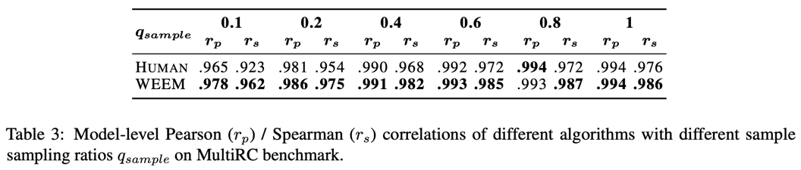

# Poor-Supervised Evaluation for SuperLLM via Mutual Consistency (ACL2024 findings)

 

#### The guidance from capability evaluations has greatly propelled the progress of human society and the development of Artificial Intelligence.  However, as LLMs evolve, it becomes challenging to construct evaluation benchmark with accurate labels for SuperLLMs whose capabilities approach or even surpass those of humans. To credibly conduct weak-supervised evaluation without accurate labels, we first prove that the consistency between the model under evaluation and the reference model, when their prediction distributions are independent and the sample size is infinite, can equivalently assess the true capabilities of the model to be evaluated. However, using either humans or LLMs as the reference model cannot sufficiently meet the conditions, for which we propose the PEEM algorithm. By treating all models under evaluation as reference models, PEEM alternately optimizes model weights and filters reference models based on EM algorithm to maximally alleviate the insufficiency of the conditions. Comprehensive experiments across 3 types of tasks with 16 mainstream LLMs validate the efficiency, universality, and effectiveness of PEEM. More generally, PEEM has advanced the evaluation paradigm evolution from human-centric to human\&model-centric, alleviating the limitations of human capabilities for evaluating SuperLLMs.
### The repo contains:
- Code for replicating the results reported in the paper.
- Responses of 16 mainstream LLMs on three datasets.
- Experimental results.

### Testing Results 
#### Results on MATH
> python MATH_peem.py

#### Results on USR
> python Usr_peem.py

#### Results on MultiRC
> python Multirc_peem.py

## Results

